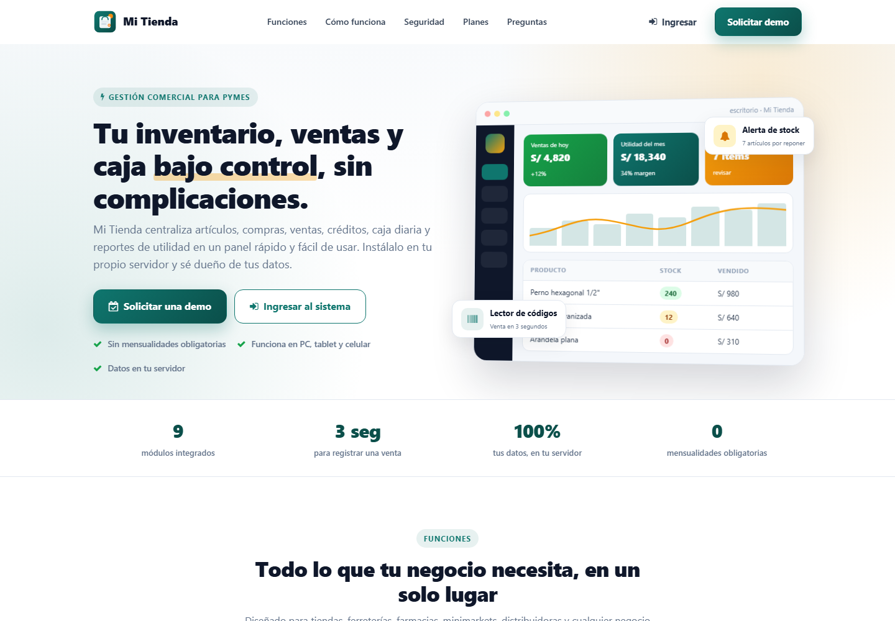
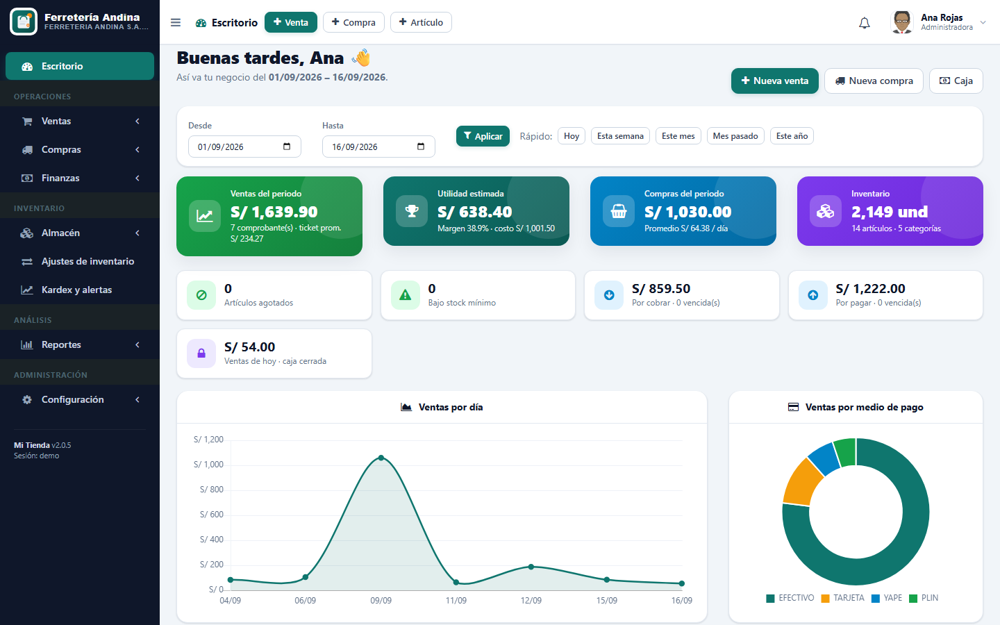
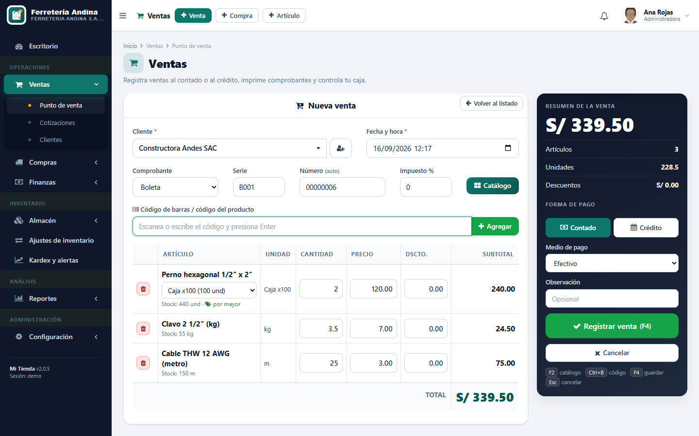
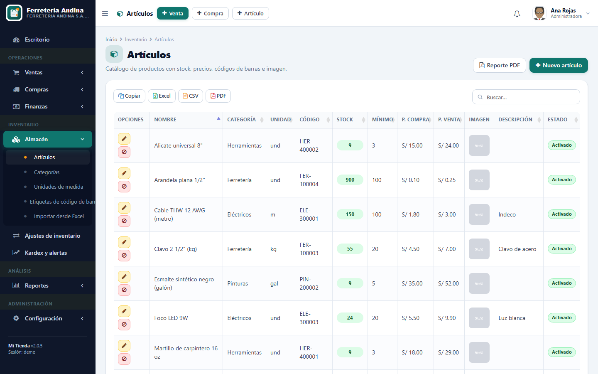
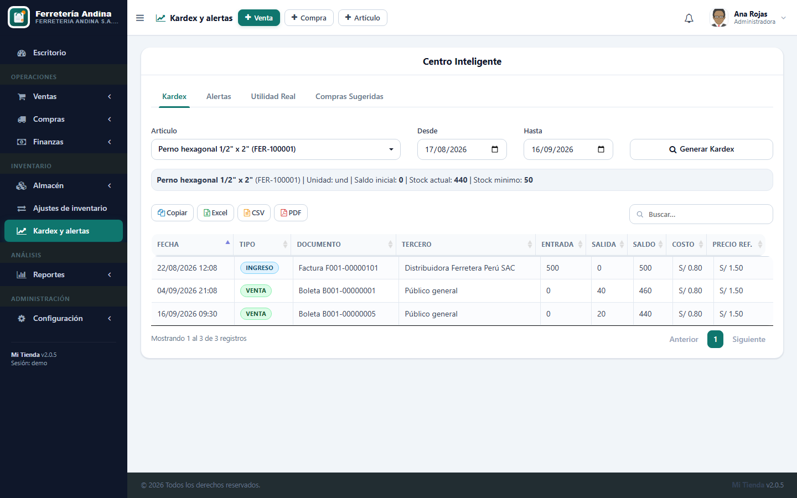

# Mi Tienda — Sistema de inventario, ventas y caja para PyMEs

Sistema web de gestión comercial en **PHP 8 puro + MySQL/MariaDB** (sin framework), pensado para tiendas, ferreterías, bodegas, boutiques y distribuidoras. Controla inventario, compras, ventas al contado y al crédito, caja diaria, cuentas por cobrar/pagar, utilidad real y reportes desde un solo panel, con seguridad de nivel producción.

**Un solo sistema que se adapta al rubro del cliente**: eliges el tipo de negocio y se habilitan las funciones de ese giro (vencimientos en abarrotes, fracciones y empaques en ferretería, tallas y colores en ropa).

> 💼 Desarrollado y mantenido por **Jersson Corilla**. Ver [Derechos de autor](#derechos-de-autor--licencia).

---

## ¿Qué incluye? (v2.0.5)

| Módulo | Qué hace |
| --- | --- |
| **Landing page** | Página pública del producto con funciones, planes, FAQ y contacto (WhatsApp / correo) |
| **Escritorio** | KPIs de ventas, compras, utilidad y margen; alertas (agotados, bajo mínimo, cuentas vencidas, caja); gráficos por día, mes, hora, medio de pago, vendedor, categoría y top productos |
| **Punto de venta** | Lector de código de barras, catálogo con búsqueda, contado o crédito, medios de pago (efectivo, tarjeta, transferencia, Yape, Plin), correlativo automático, impresión de ticket térmico y PDF A4, atajos de teclado. Según el rubro: cantidades con decimales, venta por empaque, precio por mayor automático y selección de talla/color |
| **Compras / Ingresos** | Registro por proveedor, actualiza stock y precios de referencia, contado o crédito. Admite compra por empaque, lote con fecha de vencimiento y talla/color |
| **Artículos** | Categorías, unidades de medida, stock mínimo, precios de compra/venta con margen, imagen, código de barras imprimible. Además: presentaciones (caja, rollo), escalas de precio por mayor, tallas/colores con stock propio, temporada y colección |
| **Ajustes de inventario** | Entradas y salidas manuales con motivo (conteo, merma, vencimiento, devoluciones, uso interno…) integradas al kardex, por lote o por talla/color |
| **Kardex y alertas** | Kardex por artículo (ingresos + ventas + ajustes) en unidades base, con lote y talla/color en cada movimiento; stock crítico, sin movimiento, utilidad por producto/categoría/vendedor, compras sugeridas |
| **Caja diaria** | Apertura, movimientos automáticos por ventas/cobros/compras/pagos, resumen por medio de pago, cierre con arqueo y diferencia, historial e impresión |
| **Cuentas por cobrar / pagar** | Generadas automáticamente en ventas/compras al crédito, abonos con historial, vencimientos, anulación |
| **Clientes y proveedores** | Directorio con baja lógica (se conserva el historial) y alta rápida desde ventas/compras |
| **Reportes** | Centro de reportes (utilidad, top productos, stock crítico, kardex valorizado, clientes/proveedores), compras por fecha, ventas por cliente; exportación Excel/CSV/PDF |
| **Usuarios y permisos** | 15 permisos por módulo, perfil propio con cambio de contraseña |
| **Empresa y marca** | Logo, colores, series de comprobantes, impuesto, moneda (16 monedas), mensaje del ticket |
| **Backup** | Copias completas desde el panel, descarga, restauración con copia previa automática |
| **Auditoría** | Registro de acciones por usuario, módulo y fecha; intentos de inicio de sesión |
| **Vencimientos** | Lotes con stock, estado (vencido, por vencer, vigente), valor inmovilizado y baja del lote en un clic *(rubro abarrotes)* |
| **Cotizaciones** | Proformas con validez, estados (pendiente, aceptada, rechazada, vencida, convertida), PDF y conversión a venta con un clic |
| **Importación Excel/CSV** | Artículos, clientes y proveedores desde .xlsx o .csv con plantilla descargable, vista previa, detección de duplicados, creación de categorías y ajuste de stock por conteo. Con el rubro ropa admite columnas Talla y Color (una fila por combinación) |
| **Etiquetas** | Impresión masiva de etiquetas con código de barras (3 tamaños, con precio y marca), una por artículo y por cada talla/color |
| **Instalador y demo** | `instalar.php` crea la BD, el administrador y el tipo de negocio en un minuto; datos de demostración opcionales; prueba de humo automatizada (163 comprobaciones) |

Fuera de alcance: facturación electrónica (SUNAT).

---

## Se adapta al rubro del cliente

El tipo de negocio se elige al instalar o en *Configuración → Empresa y marca*, y
puede cambiarse cuando se quiera: no borra información, solo muestra u oculta campos.

| Rubro | Qué habilita |
| --- | --- |
| **General** | Inventario estándar |
| **Abarrotes / bodega** | Lotes con fecha de vencimiento, salida del que vence primero (FEFO), bloqueo de venta de lo vencido, pantalla de vencimientos con bajas, alertas configurables, venta por fracción |
| **Ferretería / materiales** | Cantidades con decimales según la unidad (1.5 m, 0.75 kg), presentaciones con equivalencia y precio propio (Caja x100, Rollo x50), precio por mayor por escalas |
| **Ropa / calzado** | Tallas y colores con stock, código de barras y precio propios; generador de combinaciones; temporada y colección |

Internamente no se programa "por rubro" sino **por capacidad** (`vencimientos`, `lotes`,
`fracciones`, `equivalencias`, `precio_mayor`, `variantes`, `temporada`), de modo que un
rubro nuevo (farmacia, licorería) se arma combinando capacidades existentes sin tocar los
módulos. El servidor valida siempre, no solo la interfaz.

Manual de uso para el cliente final: [`docs/MANUAL.md`](docs/MANUAL.md).

---

## Seguridad

- Consultas preparadas (mysqli) en el 100 % de los modelos.
- Autenticación y permisos verificados en **todos** los endpoints AJAX y vistas.
- Contraseñas con **bcrypt** (`password_hash`); los hashes SHA256 heredados se migran solos en el primer login.
- Bloqueo por intentos fallidos (5 intentos / 15 min, por usuario e IP).
- Protección **CSRF** (header `X-CSRF-Token`) en toda escritura.
- Sesión endurecida: cookies HttpOnly + SameSite, modo estricto, expiración por inactividad y regeneración de id.
- Cabeceras HTTP de seguridad, `.htaccess` que bloquea `config/`, `modelos/`, `migrations/`, `logs/` y la ejecución de PHP en `files/`.
- Validación real de imágenes subidas (MIME + `getimagesize` + tamaño) y nombres aleatorios.
- Totales de venta/compra recalculados en servidor; transacciones con bloqueo de filas para stock y correlativos.
- Auditoría de acciones y registro de errores en `logs/app.log`.

---

## Tecnologías

| Capa | Herramientas |
| --- | --- |
| Backend | PHP 8.1+ (probado en 8.2), MySQL 5.7+ / MariaDB 10.4+, mysqli con sentencias preparadas |
| Frontend | AdminLTE 2, Bootstrap 3, jQuery, DataTables (+Buttons), Chart.js, Bootstrap-select, JsBarcode |
| Reportes | FPDF (PDF A4), ticket HTML para impresora térmica |
| Arquitectura | MVC propio: `vistas/` · `ajax/` (controladores) · `modelos/` · `config/` |

---

## Estructura del proyecto

```text
mi_tienda/
├── index.php            # Landing page pública
├── ajax/                # Controladores (un archivo por módulo, op=...)
├── config/              # global.php, Conexion.php (BD), seguridad.php (sesión, CSRF, permisos, auditoría)
├── modelos/             # Clases de dominio con SQL preparado
├── vistas/              # Páginas del panel + scripts/ (JS por módulo)
├── reportes/            # PDF (FPDF) y ticket
├── migrations/          # Cambios de esquema versionados e idempotentes
├── docs/                # DESPLIEGUE.md (instalación) y MANUAL.md (uso diario)
├── scripts/migrar.php   # Aplica migraciones pendientes (CLI)
├── public/              # CSS/JS/imagenes (custom-theme.css = tema propio)
├── files/               # Subidas (articulos, usuarios, empresa) y backups — no versionado
└── logs/                # app.log — no versionado
```

Guía técnica para desarrolladores y asistentes de IA: [`CLAUDE.md`](CLAUDE.md). Roadmap: [`PLAN_DE_TRABAJO.md`](PLAN_DE_TRABAJO.md).

### Pruebas

```bash
php scripts/smoke.php                       # 163 comprobaciones contra un servidor propio
php scripts/smoke.php https://tudominio.com # o contra una instalación existente
```

Crea un usuario QA temporal, recorre login, vistas, endpoints y el flujo completo
(caja → venta → crédito → abono → ajuste → compra → anulaciones → eliminación →
fracciones y empaques → lotes y vencimientos → tallas y colores → PDFs) y borra todo lo
que creó, incluido el usuario. Devuelve código de salida 0 si todo pasa.

---

## Instalación local

### Requisitos

- PHP >= 8.1 con extensiones `mysqli`, `mbstring`, `gd`, `fileinfo`
- MySQL >= 5.7 o MariaDB >= 10.4
- Apache con `mod_rewrite`/`AllowOverride All` (XAMPP recomendado) o el servidor embebido de PHP para pruebas

### Instalación rápida (instalador web)

1. Copia el proyecto a la carpeta pública del servidor.
2. Abre `http://tu-servidor/mi_tienda/instalar.php`, completa datos de MySQL, del administrador y el **tipo de negocio** (opcional: cargar datos de demostración).
3. Elimina `instalar.php`. Listo: entra por `vistas/login.php`.

Guía completa (manual, actualización desde v1, cPanel, VPS): [`docs/DESPLIEGUE.md`](docs/DESPLIEGUE.md).

### Instalación manual

1. Clonar el repositorio en `C:\xampp\htdocs\mi_tienda` (o la carpeta pública de tu servidor).
2. Crear la base de datos `mi_tienda` e importar `scripts/sql/esquema_base.sql` (y opcionalmente `scripts/sql/demo.sql`).
3. Copiar `config/local.example.php` a `config/local.php` y ajustar credenciales de BD, nombre del producto y `APP_ENV`:

   ```php
   return array(
     'DB_HOST' => 'localhost', 'DB_NAME' => 'mi_tienda', 'DB_USERNAME' => 'root', 'DB_PASSWORD' => '',
     'PRO_NOMBRE' => 'Mi Tienda',
     'APP_ENV' => 'production',   // oculta errores y activa logs
   );
   ```

4. Aplicar migraciones:

   ```bash
   php scripts/migrar.php --estado
   php scripts/migrar.php
   ```

5. Dar permisos de escritura a `files/` y `logs/`.
6. Abrir `http://localhost/mi_tienda/` (landing) → **Ingresar** → `vistas/login.php`.

Para pruebas sin Apache: `php -S localhost:8080` desde la raíz del proyecto.

### Primer usuario

Si la base está vacía, crea el administrador por SQL (la clave se migrará a bcrypt en el primer login):

```sql
INSERT INTO usuario(nombre,tipo_documento,num_documento,login,clave,imagen,condicion)
VALUES('Administrador','DNI','00000000','admin',SHA2('Admin1234',256),'',1);
INSERT INTO usuario_permiso(idusuario,idpermiso) SELECT LAST_INSERT_ID(), idpermiso FROM permiso;
```

Cambia la contraseña desde **Mi perfil** tras ingresar.

---

## Despliegue en producción (resumen)

- `APP_ENV = 'production'` en `config/local.php`.
- HTTPS obligatorio (las cookies de sesión se marcan `Secure` automáticamente).
- Verificar que `config/`, `modelos/`, `migrations/` y `logs/` devuelvan 403 desde el navegador.
- Programar backups (módulo Backup o `mysqldump`) y guardarlos fuera del servidor.

---

## Capturas de pantalla

*Tomadas de una instalación de demostración (`scripts/sql/demo.sql`): la ferretería, los
clientes y las ventas son ficticios.*

**Landing pública**



**Escritorio** — KPIs del periodo, alertas y gráficos



**Punto de venta** — venta por caja (empaque), por kilo y por metro en el mismo ticket



**Artículos** — catálogo con stock, precios y códigos de barras



**Kardex** — entradas, salidas y saldo por artículo



---

## Derechos de autor / Licencia

Copyright © 2026 **Jersson Jorge Corilla Miranda**. Todos los derechos reservados.

Este repositorio se publica con **fines de portafolio y demostración profesional**. Queda permitido visualizar y revisar el código como referencia técnica. No está permitido, sin autorización expresa y por escrito del autor, usar el software en producción o con fines comerciales, redistribuirlo, sublicenciarlo o revenderlo, ni eliminar este aviso.

Las librerías de terceros incluidas (FPDF, AdminLTE, Bootstrap, jQuery, DataTables, Chart.js, JsBarcode) conservan sus licencias originales.

Para licenciamiento comercial, demos o consultas: contactar al autor.

## Autor

**Jersson Jorge Corilla Miranda** — Desarrollador web full-stack
