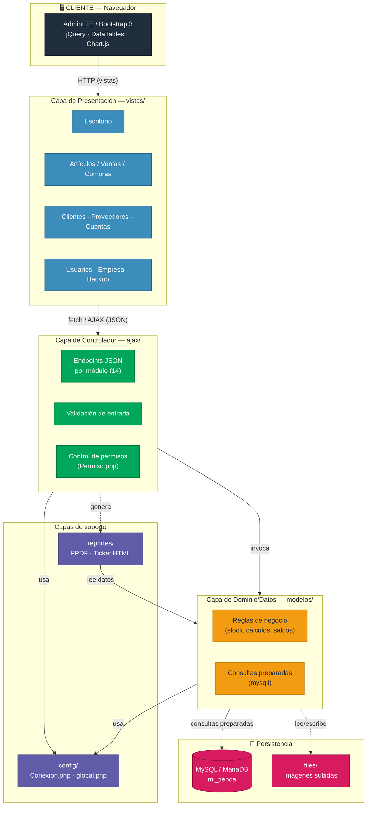

# Sistema de Gestión Comercial — Mi Tienda

Sistema web de gestión empresarial (inventario, compras, ventas y reportes) desarrollado en **PHP puro sin frameworks**, siguiendo una arquitectura MVC propia. Orientado a pequeñas y medianas empresas que necesitan controlar su stock, facturación y cuentas desde un solo panel.

> 💼 Proyecto de portafolio desarrollado y mantenido por **Jersson Corilla**. Código mostrado con fines de demostración profesional — ver [Derechos de autor](#derechos-de-autor--licencia).

---

## Métricas del proyecto

| Métrica | Valor |
| --- | --- |
| Líneas de código PHP (sin libs) | ~9,430 LOC |
| Archivos PHP propios | 59 |
| Módulos funcionales | 13 |
| Endpoints AJAX (capa controlador) | 14 |
| Modelos de negocio | 14 |
| Vistas | 21 |
| Scripts JS en frontend | 66 |
| Migraciones SQL versionadas | 2 |
| Tiempo de desarrollo activo | ~3 meses (mar–jun 2026) |
| Commits en control de versiones | 12+ |

*Conteos obtenidos directamente del repositorio (`find`, `wc -l`, `git log`) — no son estimaciones.*

### Cobertura funcional por módulo (estimado)

> Los porcentajes siguientes son una **estimación cualitativa** de madurez funcional (CRUD completo, validaciones, permisos y reportes asociados), no una métrica de cobertura de pruebas automatizadas — el proyecto aún no cuenta con suite de tests.

| Módulo | Madurez estimada | Detalle |
| --- | --- | --- |
| Ventas / Facturación | 95% | Boleta, factura, ticket, series de comprobante |
| Compras / Ingresos | 90% | Registro por proveedor, actualización de stock |
| Artículos / Inventario | 90% | CRUD, categorías, unidades, imagen, stock |
| Usuarios y permisos | 85% | Permisos granulares por módulo |
| Reportes (PDF/Excel) | 85% | FPDF + exportación DataTables Buttons |
| Cuentas por cobrar/pagar | 80% | Seguimiento de saldos y vencimientos |
| Dashboard / Escritorio | 80% | Gráficos Chart.js por periodo |
| Configuración de empresa | 75% | Logo, moneda, impuesto, series |
| Backup de base de datos | 70% | Exportación manual desde el panel |
| Pruebas automatizadas | 0% | Pendiente — sin tests unitarios/integración aún |

---

## Capturas de pantalla

> *Agregar imágenes del dashboard, módulo de ventas y reportes.*

---

## Características principales

- **Dashboard** con gráficos de ventas y compras por periodo (Chart.js)
- **Gestión de artículos** con categorías, unidades de medida e imagen de producto
- **Compras e ingresos** con detalle por proveedor y fecha
- **Ventas** con emisión de boleta, factura y ticket de caja imprimible
- **Clientes y proveedores** con historial de transacciones
- **Reportes en PDF** (FPDF) y exportación a Excel/CSV (DataTables Buttons)
- **Cuentas por cobrar y por pagar**
- **Gestión de usuarios y permisos** por módulo (escritorio, almacén, compras, ventas, acceso)
- **Configuración de empresa**: logo, colores, series de comprobantes, moneda e impuesto
- **Backup de base de datos** desde el panel
- **Moneda configurable**: S/, $, € y otras

---

## Tecnologías

| Capa           | Herramientas                                        |
| -------------- | --------------------------------------------------- |
| Backend        | PHP 8.x, MySQL / MariaDB, mysqli nativo             |
| Frontend       | AdminLTE, Bootstrap 3, jQuery, DataTables, Chart.js |
| Reportes       | FPDF, ticket HTML imprimible                        |
| Arquitectura   | MVC simple: `modelos/` · `ajax/` · `vistas/`        |

---

## Arquitectura

El sistema sigue un patrón **MVC desacoplado en capas**, sin framework, donde cada módulo de negocio (artículos, ventas, compras, etc.) replica la misma estructura de tres capas:



- **Vistas** (`vistas/`): renderizan el HTML/AdminLTE y delegan toda interacción a llamadas AJAX, sin lógica de negocio embebida.
- **Controladores AJAX** (`ajax/`): un endpoint por módulo, reciben la petición, validan entrada y delegan al modelo correspondiente.
- **Modelos** (`modelos/`): encapsulan las consultas SQL y reglas de negocio (stock, permisos, cálculos de cuentas).
- **Reportes** (`reportes/`): generación de PDF (FPDF) y tickets imprimibles a partir de los datos del modelo.
- **Config** (`config/`): conexión única a base de datos (`Conexion.php`) y constantes globales (`global.php`).
- **Migrations** (`migrations/`): cambios de esquema versionados de forma incremental, en lugar de un dump único.

### Estructura del proyecto

```text
mi_tienda/
├── ajax/           # Controladores — endpoints JSON/HTML por módulo
├── config/         # Conexión (mysqli) y configuración global
├── files/          # Archivos subidos (imágenes, empresa) — fuera de git
├── fpdf181/        # Librería de terceros para generación de PDF
├── migrations/     # Scripts SQL incrementales versionados
├── modelos/        # Capa de dominio: lógica de negocio y consultas
├── public/         # Assets de UI (AdminLTE, CSS, JS, imágenes)
├── reportes/       # Generación de reportes PDF y ticket de impresión
├── vistas/         # Capa de presentación
└── index.php       # Punto de entrada / enrutador de vistas
```

### Decisiones de diseño relevantes

- **Sin ORM ni framework**: control total sobre las consultas SQL, pensado para entornos de hosting compartido típicos de PyMEs.
- **mysqli con consultas preparadas**: para mitigar inyección SQL en los modelos.
- **Permisos por módulo**: cada usuario tiene acceso granular (`Permiso.php`) a escritorio, almacén, compras, ventas y administración.
- **Migraciones incrementales** en lugar de exportar el `.sql` completo: el dump de base de datos no se versiona en git (ver `.gitignore`), solo los cambios de esquema.

---

## Instalación local

### Requisitos

- PHP >= 8.1 con extensiones `mysqli`, `mbstring`, `gd`
- MySQL >= 5.7 o MariaDB equivalente
- Apache (recomendado: XAMPP)

### Pasos

1. Clonar el repositorio en `C:\xampp\htdocs\mi_tienda`
1. Crear la base de datos `mi_tienda` en MySQL
1. Importar el script SQL (ver sección siguiente)
1. Editar la configuración de conexión:

   ```php
   // config/global.php
   define("DB_HOST",     "localhost");
   define("DB_NAME",     "mi_tienda");
   define("DB_USERNAME", "root");
   define("DB_PASSWORD", "");
   define("DB_ENCODE",   "utf8");
   ```

1. Levantar Apache y MySQL, luego abrir [http://localhost/mi_tienda](http://localhost/mi_tienda)

### Base de datos

El script SQL **no se incluye en el repositorio** por seguridad. Solicitarlo al autor o generarlo desde el módulo de **Backup** del propio sistema.

---

## Credenciales de demo

| Campo   | Valor        |
| ------- | ------------ |
| Usuario | `jersson123` |
| Clave   | `12345`      |

> Cambiar las credenciales antes de cualquier despliegue en producción.

---

## Módulos del sistema

| Módulo      | Descripción                                        |
| ----------- | -------------------------------------------------- |
| Escritorio  | Dashboard con métricas y gráficos                  |
| Artículos   | CRUD de productos con stock e imagen               |
| Categorías  | Clasificación de artículos                         |
| Unidades    | Unidades de medida configurables                   |
| Proveedores | Gestión de proveedores                             |
| Clientes    | Gestión de clientes                                |
| Compras     | Registro de ingresos de mercadería                 |
| Ventas      | Emisión de comprobantes y ticket                   |
| Consultas   | Reportes por fecha, cliente y proveedor            |
| Cuentas     | Cuentas por cobrar y por pagar                     |
| Usuarios    | Gestión de usuarios y permisos por módulo          |
| Empresa     | Configuración de marca, moneda e impuesto          |
| Backup      | Exportación de base de datos                       |

---

## Derechos de autor / Licencia

Copyright © 2026 **Jersson Jorge Corilla Miranda**. Todos los derechos reservados.

Este repositorio se publica con **fines exclusivamente de portafolio y demostración profesional**. Queda permitido:

- Visualizar y revisar el código como referencia técnica o muestra de trabajo.

No está permitido, sin autorización expresa y por escrito del autor:

- Usar este software, en todo o en parte, en un entorno de producción o comercial.
- Redistribuir, sublicenciar o revender el código fuente.
- Eliminar o modificar este aviso de derechos de autor en copias del proyecto.

Las librerías de terceros incluidas (FPDF, AdminLTE, Bootstrap, jQuery, DataTables, Chart.js) conservan sus propias licencias originales.

Para solicitar autorización de uso, licenciamiento comercial o consultas sobre el proyecto, contactar al autor.

## Autor

**Jersson Jorge Corilla Miranda** — Desarrollador web full-stack


